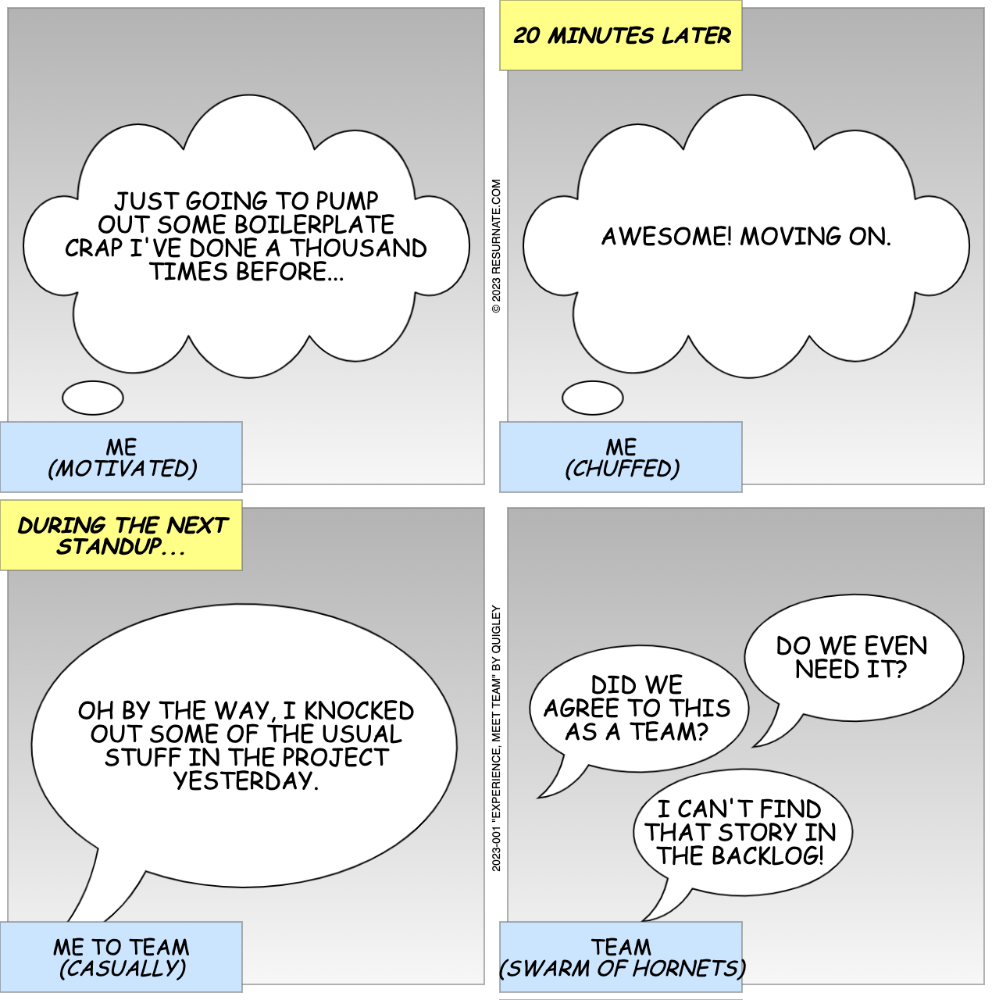

# Resurnate Canvas

Resurnate Canvas is a standalone browser-based tool that can dynamically create a comic strip from JSON metadata.
This tool does not rely on any external dependencies; hence, it's just plain vanilla HTML, CSS and JavaScript.
It can even run on a local web server, without the need for the Internet.

## Example

The following JSON metadata will create the four (4) panel comic strip below.

```json
{
  "version": "1",
  "id": "2023-001",
  "title": "Experience, Meet Team",
  "author": "Quigley",
  "panels": [
    {
      "image": "thought1",
      "bubbles": [
        {
          "position": 1,
          "text": [
            "Just going to pump",
            "out some boilerplate",
            "crap I've done a thousand",
            "times before..."
          ]
        }
      ],
      "captions": [
        {
          "position": 3,
          "text": [
            "Me",
            "(Motivated)"
          ]
        }
      ]
    },
    {
      "image": "thought1",
      "bubbles": [
        {
          "position": 1,
          "text": [
            "Awesome! Moving on."
          ]
        }
      ],
      "captions": [
        {
          "position": 1,
          "text": [
            "20 minutes later"
          ]
        },
        {
          "position": 3,
          "text": [
            "Me",
            "(Chuffed)"
          ]
        }
      ]
    },
    {
      "image": "speech1",
      "bubbles": [
        {
          "position": 1,
          "text": [
            "Oh by the way, I knocked",
            "out some of the usual",
            "stuff in the project",
            "yesterday."
          ]
        }
      ],
      "captions": [
        {
          "position": 1,
          "text": [
            "During the next",
            "standup..."
          ]
        },
        {
          "position": 3,
          "text": [
            "Me to Team",
            "(Casually)"
          ]
        }
      ]
    },
    {
      "image": "speech3",
      "bubbles": [
        {
          "position": 1,
          "text": [
            "Do we even",
            "need it?"
          ]
        },
        {
          "position": 2,
          "text": [
            "Did we",
            "agree to this",
            "as a team?"
          ]
        },
        {
          "position": 3,
          "text": [
            "I can't find",
            "that story in",
            "the backlog!"
          ]
        }
      ],
      "captions": [
        {
          "position": 3,
          "text": [
            "Team",
            "(Swarm of hornets)"
          ]
        }
      ]
    }
  ]
}
```



## Components

- The strip will have 2 panels per row, with a minimum of 2 rows of panels; hence, a minimum of 4 panels total.
- If there is an uneven number of panels, only the last row will have a single panel.
- Each panel consists of the following components that will contain text:

| Component | Description                                                                        |
|-----------|------------------------------------------------------------------------------------|
| Captions  | These are the rectangular boxes in yellow and blue, which can appear in any corner |
| Bubbles   | These are the speech, whisper, thought, burst and so on bubbles                    |

- Each panel will have a background image, which includes empty bubbles.
- It is the responsibility of the tool to draw the text for all components.
- On the first row between the two panels, the `copyright` text is drawn.
- On the second row between the the two panels, the `attribution` text is drawn.

## Panel Attributes

- The `image` attribute is used to determine the background image and the number of bubbles to fill with text.
- It is formatted as `<type><bubbles>`.
- For example, `speech3`.
- Each `bubbles` attribute aligns with the number of bubbles in the background image.
- The bubble `position` aligns from top (or highest) bubble to bottom (lowest).
- Each `captions` attribute aligns with a corner of the panel.
- The caption `position` aligns to upper-left (1), upper-right (2), lower-left(3) or lower-right(4).
- A caption with no text will not be drawn.
- Each `text` attribute is drawn on a separate line.

## Local Content Creation

In order to create content locally, one can clone this repository and install a web server.
We recommend installing [Browsersync](https://browsersync.io/).
Once installed, simply navigate to the project via the terminal and run the following command:

`browser-sync start -s`

Your website should now be accessible via the browser at http://localhost:3000/.
Any changes to the project will be automatically synced by the web server.
One simply needs to refresh the page in the browser.

Now go create something that ***RESURNATES*** with you!