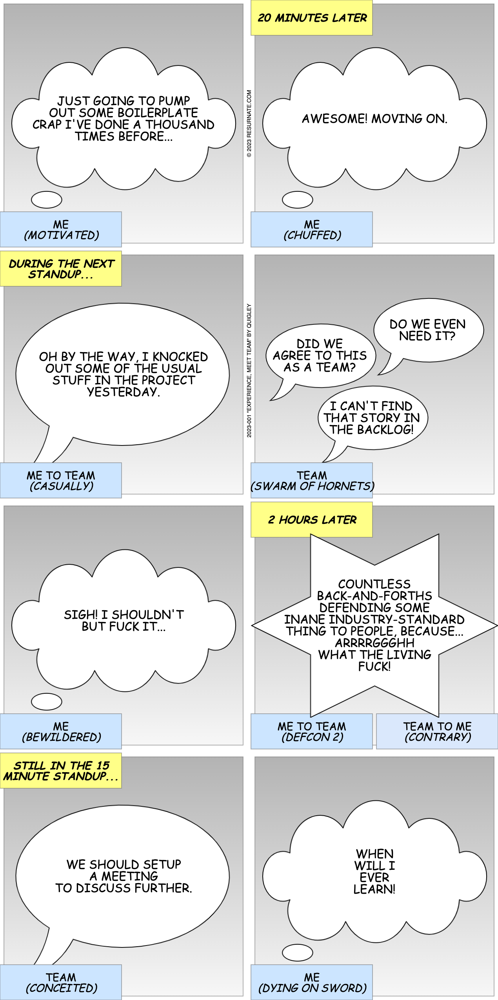

# Canvas Tool

## Introduction

### Purpose

- The purpose of this project is to create a standalone browser-based tool that can dynamically create a comic strip from JSON metadata.
- The tool should not rely on any external dependencies, other than HTML, CSS and JavaScript.

### Scope

- It is expected that the HTML Canvas or SVG elements will be used (developer discretion).
- The tool should run on a computer locally, without the need for the Internet.
- Wrapper JavaScript libraries such as Fabric.js are acceptable, as long as they can be downloaded and made available locally.
- An image resolution that strikes the balance between file size (impacts rendering) and readability (on both desktop or mobile device) is required.

## Example

Below is an example of the desired output for the tool.

- The comic strip will have 2 panels per row, with a minimum of 2 rows of panels; hence, a minimum of 4 panels total.
- If there is an uneven number of panels, only the last row can have a single panel (aligned in the center or left).
- Each panel consists of the following components that will contain text:

| Component | Description                                                                        |
|-----------|------------------------------------------------------------------------------------|
| Captions  | These are the rectangular boxes in yellow and blue, which can appear in any corner |
| Bubbles   | These are the speech, thought or impact (not shown) bubbles                        |

- Each panel will have a background image, which will include all the captions and bubbles other than the text.
- It is the responsibility of the tool to populate the text for all components.
- Furthermore, on the first row between the two panels, the copyright label is dynamically populated.
- Finally, in the second row between the the two panels, the strip label is also populated.
- The font style for all bubble and caption text is ***comic sans ms***.
- The font size for all bubbles is 30.
- The font size for all captions is 27, with the yellow captions in bold.
- The font style and size for all label text is ***Helvetica*** and 12 respectively.

> **Note**
> 
> All background image sizes, fonts and so on are flexible, dependent on finding optimal image resolution.
> ***I'm open to any suggestions!***

## Design

- A [sample](./doc/sample.json) metadata json file is provided.
- It contains all the details to potentially create the sample image above.

### Background Attribute

- This attribute represents the name of the image resource.
- It is formatted as `<type>-<version>-<bubbles>-<captions>.<extension>`.
- For example, `speech-1-3-0010.png`.
- The type is either thought, speech or impact.
- The version will always be 1 for now.
- The bubbles indicate the number of bubbles in the background image and expected text elements in the metadata.
- The captions indicate the number of captions in the background image and expected text elements in the metadata.
- The caption portion is 4 zero (0) or one (1) digits, which represent the top-left, top-right, bottom-left and bottom-right caption locations respectively.
- A zero (0) means no caption, whereas a one (1) means the caption at that location is available and expected to be populated with text.
- For example, if there are 3 ones, then we expect there to be three text elements defined in the metadata.

> **Note**
>
> No validation is required for this prototype; hence, it's out of scope.
> It is expected that valid metadata will be provided.
> The most important goal is to generate the comic strip image itself.

## Final Thoughts

- I will provide you developer access to the repository.
- I will provide (and adjust if necessary) all background images in the `img` directory.
- All CSS and JavaScript files should be stored in the `css` and `js` directories appropriately.
- Simply use the `index.html` file as the entry point for the tool.
- The tool should allow the user to upload or cut-n-paste the metadata, then display or download the rendered image.
- All example metadata files should be stored in the `doc` directory for testing and verification purposes.

I appreciate your help!